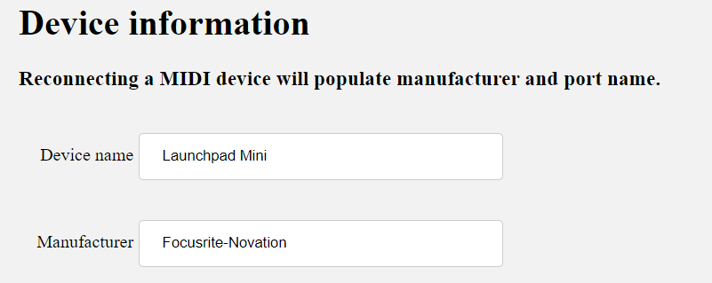
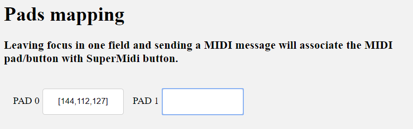
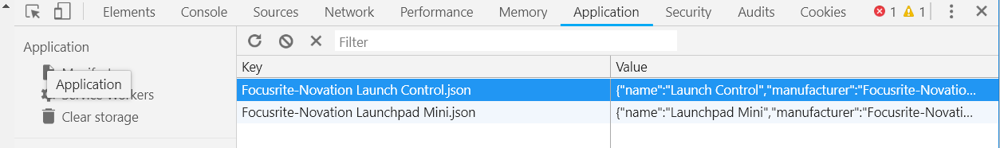

# SuperMidiJS
A generic wrapper for using MIDI in the browser. It's primarily target at exposing MIDI messages as pads and sliders to javascript code.
** Currently looking for contributors. Create an issue if you're interested in colloborating. **

# Features, or wish-list 
* Provides a predefined, configurable list of `PADS` and `KNOBS` or `SLIDERS`
* Because it's configurable, it can be used with **any** MIDI controller
* Configurations for common devices can be crowd-sourced and published
* Creative coders can customize the mapping between the physical controller and the logical objects 


# Applications
The library is primarily focused on interactive projects which could MIDI devices as a means of capturing input from user and/developers. 
It exposes pads and sliders objects, which you can attach to your code as boolean or float values.
``` Javascript
if (controller.padSet.pads[1].status == true) {
   strokeWeight(2);
   stroke(0);
   fill(255, 0, 0);
   rect(s * 2 * i, 50, s, s);
} else {
   noFill();
   rect(s * 2 * i, 50, s, s);
}
```

# About MIDI devices, just in case... 
MIDI devices communicate by sending short messages to computers. The MIDI protocol was designed for music applications, therefore the messages might represent music notes, or control messages. Most devices offer a way to choose wich notes are sent when certain buttons are pressed. Specialized software for music, known as [DAW](https://en.wikipedia.org/wiki/Digital_audio_workstation), tipically has built-in configurations to assign notes and control messages to certain commands.


# Configuration
If a pre-defined mapping is not available, the library will load a configuration form. 

## Device information
As soon as you plug a MIDI controller, the form will fill-up the manufacturer and port name:


# Mapping
Once device info is populate, select one the pads, and tap on the MIDI controller key 
you want to associate with that PAD. You can continuously press other keys, and the form will move to the next available key.


# Save
Once you are done with the mappings, hit Submit. The mapping will be saved in your local storage,
and will be reloaded next time you use SuperMIDIJS.


